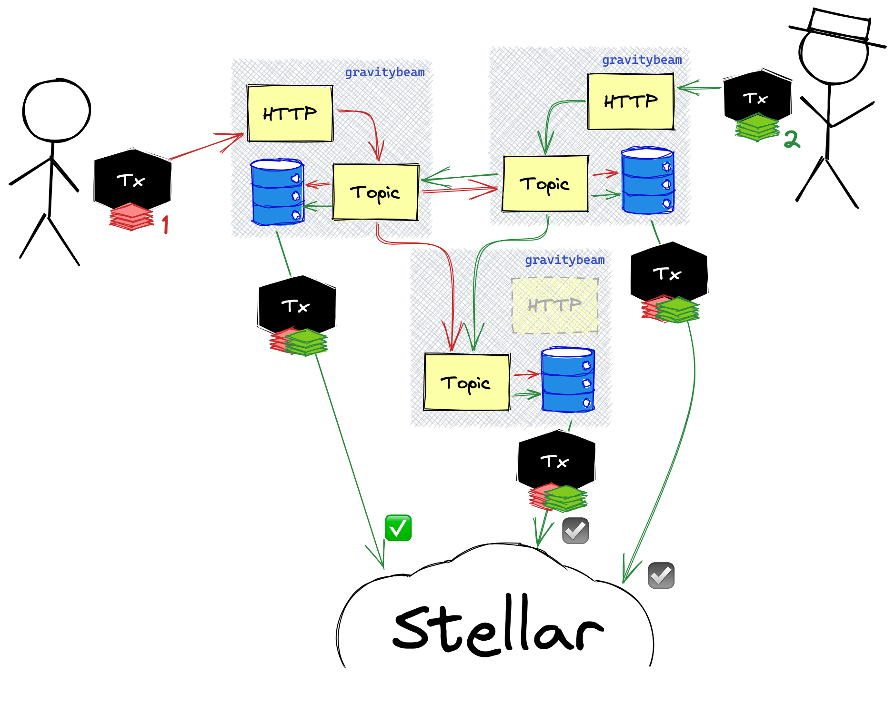

# gravitybeam

Gravitybeam accepts transactions and their signatures from any source that
pushes them to gravitybeam. Gravitybeams merge all signatures provided and
submit the transactions to the network once they are authorized with sufficient
signature weight to satisfy the threshold requirements of the transaction and
its accounts.

Gravitybeam accepts transactions on a HTTP port using a JSON format to its `/tx`
endpoint:

```json
{
    "xdr": "<base-64 xdr>"
}
```

Gravitybeam shares known signatures with other gravitybeam instances using
libp2p. An instance of gravitybeam will find local instances with mDNS or can be
configured to connect to one or more peers via command line options.



## Install

```
go install github.com/leighmcculloch/gravitybeam@latest
```

## Usage

```
Usage of gravitybeam:
  -db string
        File path to the db to write to and read from (also via DB_PATH) (default "gravitybeam.db")
  -horizon string
        Horizon URL (also via HORIZON_URL) (default "https://horizon-testnet.stellar.org")
  -peers string
        Comma-separated list of addresses of peers to connect to on start (also via PEERS)
  -port-http string
        Port to accept HTTP requests on (also via PORT_HTTP) (default "0")
  -port-p2p string
        Port to accept P2P requests on (also via PORT_P2P) (default "0")
```

## Example

1. Start multiple instances of gravitybeam locally that will discover each other automatically.
   ```
   gravitybeam -port-http 8080
   ```
   Or, start multiple instances of gravitybeam remotely with peers specified.
   ```
   gravitybeam -port-http 8080 -peers /ip4/123.123.123.123/tcp/59833/p2p/QmZBfVvVTZuCBD8aSm3z2mcMQ7bi49GF4SvY8LhXcUegQS
   ```

2. Send a request with a transaction.
   ```
   curl -d '{"xdr":"..."}' http://localhost:8080/tx
   ```
